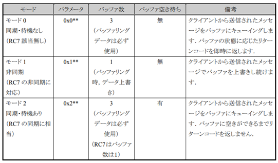
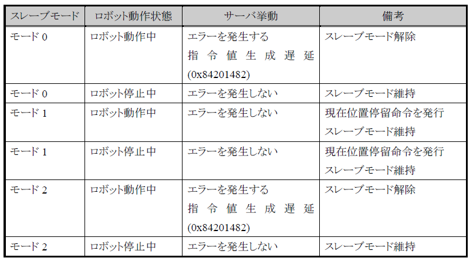

===================================
b-cap slave move
===================================

b-cap Slave Move とは
===============================

b-capプロトコルを使用し、ロボットに短い時間周期で位置・姿勢データを送信することで、ロボットを制御する機能です。

通常のMoveコマンドは目標位置を指定し、ロボットの移動経路(軌跡)はロボットコントローラが計算します(PTP,CP,Move C,Move S)。
しかし、Slave Moveはその移動経路を逐次PCから送信することで移動経路を自在に操作可能です。逆に、速度、加速度まで考慮した目標位置・姿勢データを送信する必要があります。

b-cap Slave Move の使用条件
===============================

8ms間隔でデータを送信する必要がある。(バッファありのモード等あり)
送信するデータは速度、加速度まで考慮されたデータである必要がある
無料ライセンスをRC8へ入れる必要がある。

Move: 

.. image:: https://www.denso-wave.com/imageupd/21001/9277_addblock3_0.png

b-cap slave move: 

.. image::  https://www.denso-wave.com/imageupd/21001/9277_addblock3_1.png

b-cap Slave mode
===============================

要求される応答速度に応じて、slave modeを変更することでMAX8msecでの軌道の変更が可能になります。

バッファアンダーフロー時(指令値が空になる)の挙動はモード毎に異なります。

